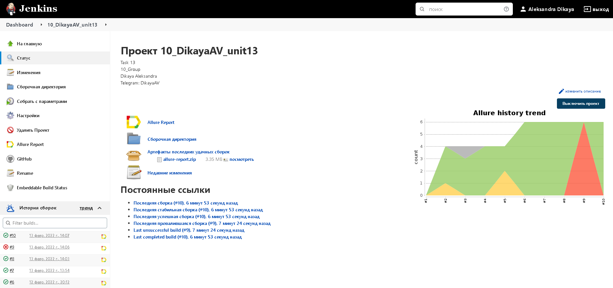
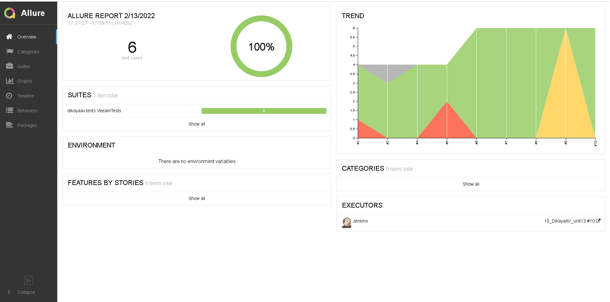

# Проект по автоматизации тестирования для Veeam
<a target="_blank" href="https://www.veeam.com/ru/">Веб сайт Veeam</a>

## :pushpin: Содержание:

- [Технологии и инструменты](#earth_africa-технологии-и-инструменты)
- [Реализованные проверки](#earth_africa-Реализованные-проверки)
- [Сборка в Jenkins](#earth_africa-Jenkins-job)
- [Запуск из терминала](#earth_africa-Запуск-тестов-из-терминала)
- [Allure отчет](#earth_africa-Allure-отчет)
- [Отчет в Telegram](#earth_africa-Уведомление-в-Telegram-при-помощи-бота)
- [Видео примеры прохождения тестов](#earth_africa-Примеры-видео-о-прохождении-тестов)

## :rocket: Технологии и инструменты

<p align="center">
<a href="https://www.jetbrains.com/idea/"></a>
<a href="https://www.java.com/"></a>
<a href="https://github.com/"></a>
<a href="https://junit.org/junit5/"></a>
<a href="https://gradle.org/"></a>
<a href="https://selenide.org/"></a>
<a href="https://aerokube.com/selenoid/"></a>
<a href="https://github.com/allure-framework/allure2"></a>
<a href="https://www.jenkins.io/"></a>
</p>

## :scroll: Реализованные проверки

- ✓ Поиск вакансии QA Automation.
- ✓ Открытие статьи о Biocad и Exchange (параметризованные тесты).
- ✓ Поиск информации о компании Biocad в скачанном PDF файле.
- ✓ Смена языка с русского на английский.
- ✓ Заполнение Запроса в отдел продаж.

## </a> Jenkins job
<a target="_blank" href="https://jenkins.autotests.cloud/job/10_DikayaAV_unit13/">Сборка в Jenkins</a>
<p align="center">
<a href="https://jenkins.autotests.cloud/job/10_DikayaAV_unit13/"></a>
</p>

### Параметры сборки в Jenkins:

- browser (браузер, по умолчанию chrome)
- browserVersion (версия браузера, по умолчанию 91.0)
- browserSize (размер окна браузера, по умолчанию 1920x1080)
- remoteDriverUrl (логин, пароль и адрес удаленного сервера selenoid)
- videoStorage (адрес, по которому можно получить видео)
- threads (количество потоков)

## :computer: Запуск тестов из терминала

Локальный запуск:
```bash
gradle clean test
```

Удаленный запуск:
```bash
clean
test
-Dbrowser=${BROWSER}
-DbrowserVersion=${BROWSER_VERSION}
-DbrowserSize=${BROWSER_SIZE}
-DbrowserMobileView="${BROWSER_MOBILE}"
-DremoteDriverUrl=https://${LOGIN}:${PASSWORD}@${REMOTE_DRIVER_URL}/wd/hub/
-DvideoStorage=https://${REMOTE_DRIVER_URL}/video/
-Dthreads=${THREADS}
```

## </a> Отчет в <a target="_blank" href="https://jenkins.autotests.cloud/job/10_DikayaAV_unit13/allure/">Allure report</a>

### Основное окно

<p align="center">

</p>

### Тесты

<p align="center">

</p>

### Гафики

<p align="center">

</p>

## </a> Уведомление в Telegram при помощи бота

<p align="center">

</p>


### </a> Примеры видео о прохождении тестов

<p align="center">
 
</p>
